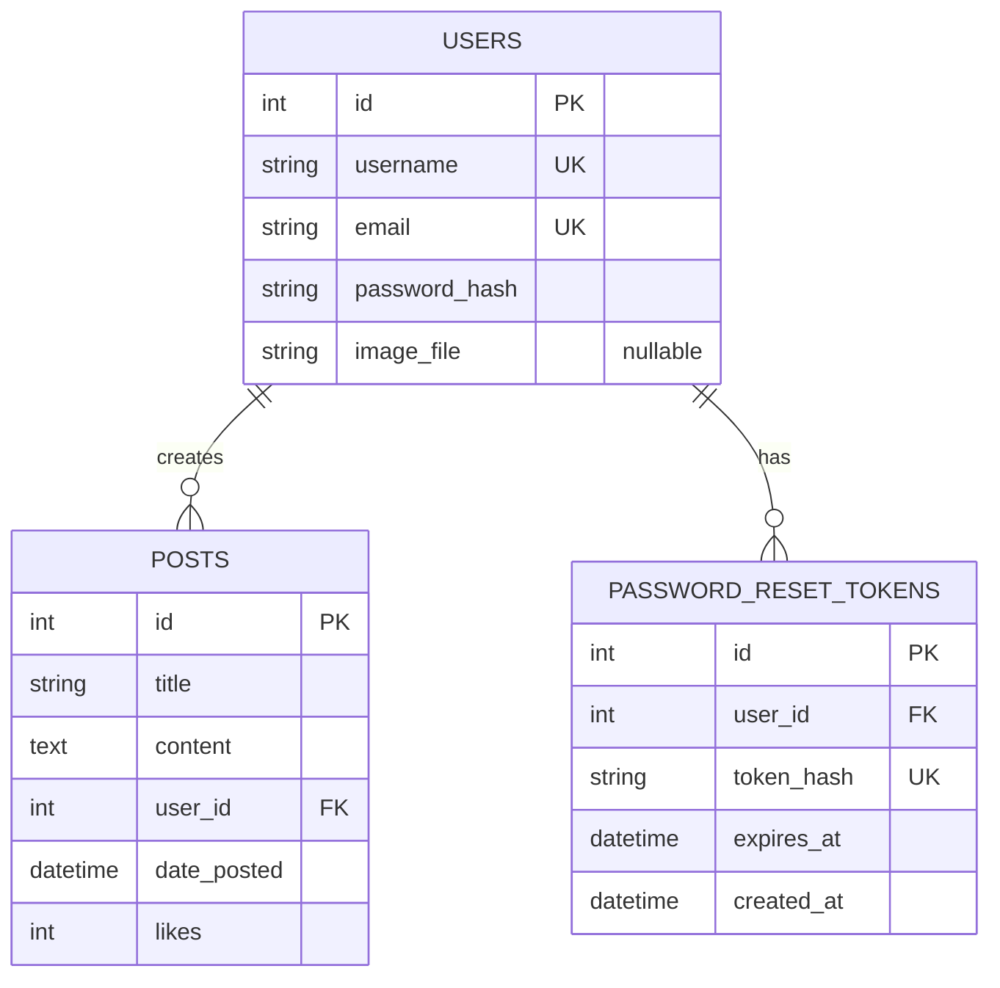

# Modelo de entidad relación 

```mermaid
erDiagram
USERS {
        int id PK
        string username UK
        string email UK
        string password_hash
        string image_file "nullable"
}

POSTS {
        int id PK
        string title
        text content
        int user_id FK
        datetime date_posted
        int likes
}

PASSWORD_RESET_TOKENS{
        int id PK
        int user_id FK
        string token_hash UK
        datetime expires_at
        datetime created_at
}

USERS || --O{POSTS : "creates"
USERS || --o{PASSWORD_RESET_TOKENS: "has"

```
